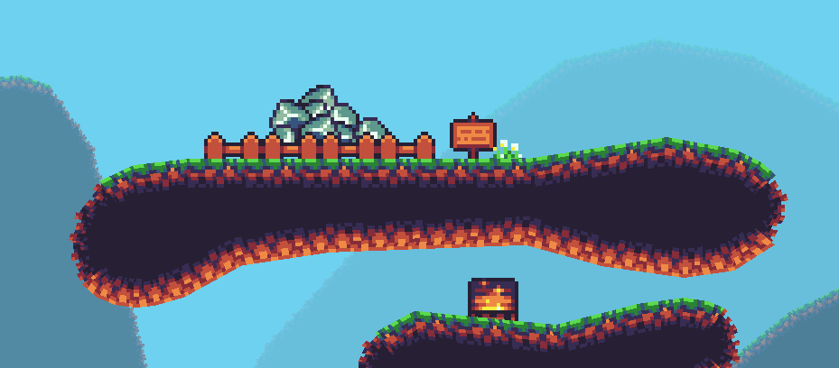
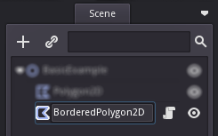
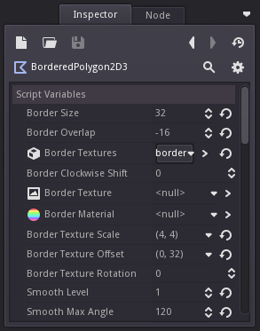
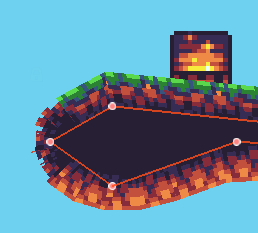

# Bordered Polygon2D for Godot Engine 3+

Add borders to your Polygon2Ds. Useful for creating maps using textures.

## Usage

Create a `BorderedPolygon2D` node in your scene.

Attach either a single border texture or a TileSet with several border texures.
You might need to use options to proper align/rotate/scale texture.

Draw your polygon and voilà!

### Examples

Visit the [examples folder](./examples) to see different examples on how to use
BorderedPolygon2D.

## Options

There are some options available to customize BorderedPolygon2D:

- **Border Size**: The border size in pixels.
- **Border Overlap**: The border overlap in pixels. Specify how many pixels of
    the border should overlap with the inner texture. Possitive numbers will
    overlap. Negative will move the borders away from the fill texture.
- **Border Texture**: A single texture\* for all borders.
- **Border Textures**: Tileset with border textures\*. This is basically a
    collection of sprites. BorderPolygon2D will take the texture inside each
    sprite. If set, "Border Texture" option's value will be ignored. Image order
    is important here, first image should be the north border image and the next
    image should be the right border clockwise, and so on. For example, if you
    have four images, you will need to arrange them as tileset children like this:
    [0:North, 1:East, 2:South, 3:West]
- **Border Material**: A material to apply to borders. You can also include
    materials in your tileset border sprites, these materials will take
    precedence over the defined in this option.
- **Border Clockwise Shift**: Apply clockwise shift to border textures.
- **Border Texture Scale**: Apply scale to all border textures.
- **Border Texture Offset**: Apply offset to all border textures.
- **Border Texture Rotation**: Apply rotation to all border textures.
- **Smooth Level**: This option determines how smooth will be your borders. Set
    0.0 for sharp and 1.0 for smooth. The more smooth, the more border polygons
    that will be created.
- **Smooth Max Angle**: Select the max angle to smooth. Tipically, a sharp corner
    will be between 0° and 45° degrees, but you could also smooth 90° angles.
    This option allows a maximum of 179° degrees. Default value is 90° degrees.

\*All textures must have same orentation (north) and will be
automatically rotated when inserted into borders.

## Future Work

Want to know what is ahead? Visit the [features list for the next version](../../milestone/2)!
